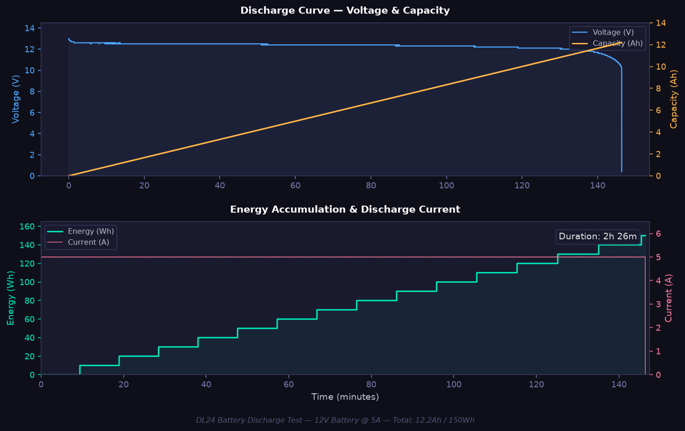

# DL24 BLE — Electronic Load Controller

Linux-based BLE control, monitoring, and data logging for **Atorch DL24/P/M** electronic loads (150W DC load / battery capacity tester).

## Features

- **Live Terminal Monitor** — Rich TUI: voltage, current, power, resistance, temperature
- **Data Logging** — CSV or JSON with timestamps
- **Battery Capacity Test** — CC discharge with auto-cutoff + summary report
- **Web Dashboard** — Real-time graphs via browser (FastAPI + Plotly.js)
- **Auto-recording** — Starts on load detection, stops & reports on current drop
- **Raw Packet Debug** — Hex dump and protocol analysis
- **Async BLE** — Built on `bleak`, works with HCI5+ adapters

## Requirements

- **Python 3.9 – 3.13** (3.14 not yet compatible with bleak)
- **BlueZ** (Linux Bluetooth stack)
- BLE-capable Bluetooth adapter

## Quick Start

```bash
git clone https://github.com/YOUR_USER/dl24-ble.git
cd dl24-ble
python3.12 -m pip install -e .
```

Grant BLE permissions (optional):
```bash
sudo setcap 'cap_net_raw,cap_net_admin+eip' $(which python3.12)
```

## CLI Usage

```bash
dl24 discover                          # Scan for devices
dl24 monitor                           # Live Rich TUI
dl24 monitor -d XX:XX:XX:XX:XX:XX     # Connect to specific device
dl24 log --format csv -o data.csv      # Log to CSV
dl24 log --format csv --duration 3600  # 1-hour log
dl24 log --format json -o data.jsonl   # JSON Lines
dl24 bat-test -i 1.0 -u 3.0           # Battery test: 1A to 3.0V
dl24 bat-test -i 0.5 -u 2.8 -T 1800   # 30-min max, 0.5A
dl24 reset                             # Reset all counters
dl24 raw                               # Raw hex debug
```

## Web Dashboard

```bash
python3.12 web/run_web.py              # → http://localhost:9090
```

Live metrics, discharge graph (voltage + capacity), auto-recording, CSV download.

## Python API

```python
import asyncio
from dl24_ble import DL24Device

async def main():
    device = DL24Device()
    device.on_measurement(lambda m: print(f"{m.voltage:.1f}V {m.current:.3f}A"))
    await device.connect()
    await asyncio.sleep(10)
    await device.disconnect()

asyncio.run(main())
```

## Configuration

```yaml
# config.yaml
dl24:
  device_name: "DL24_BLE"
  device_address: ""          # MAC or empty for auto-scan
  scan_timeout: 5.0
  reconnect: true
  web_port: 9090
```

## Project Structure

```
dl24-ble/
├── dl24_ble/           # Core: protocol, BLE device, models
├── cli/                # CLI: monitor, logger, battery test
├── web/                # Web dashboard (FastAPI + Plotly.js)
├── config.yaml
├── requirements.txt
├── setup.py
└── Makefile
```

## BLE Protocol

Reverse-engineered from multiple sources:

| Source | Description |
|---|---|
| [NiceLabs/atorch-console](https://github.com/NiceLabs/atorch-console) | Original protocol docs |
| [syssi/esphome-atorch-dl24](https://github.com/syssi/esphome-atorch-dl24) | ESPHome integration |
| [adlerweb/DL24_BLE_Logger](https://github.com/adlerweb/DL24_BLE_Logger) | gattlib BLE logger |
| [Flaviu Tamas](https://flaviutamas.com/2022/dl24m-reversing) | Reverse engineering |

- BLE Service: `0000FFE0-0000-1000-8000-00805F9B34FB`
- Characteristic: `0000FFE1-0000-1000-8000-00805F9B34FB`
- Packet: `FF 55` header, XOR `0x44` checksum, 36 bytes, ~1 Hz
- Voltage: 24-bit BE / 10 (0.1V BLE resolution)

## Test Report

```
Discharge Current : 5.0 A (constant)
Duration          : 2h 26m 23s
Start Voltage     : 13.0 V  →  End: 0.4 V
★ Capacity        : 12.19 Ah
★ Energy          : 150 Wh
Avg Temperature   : 46 °C
```



## License

MIT
